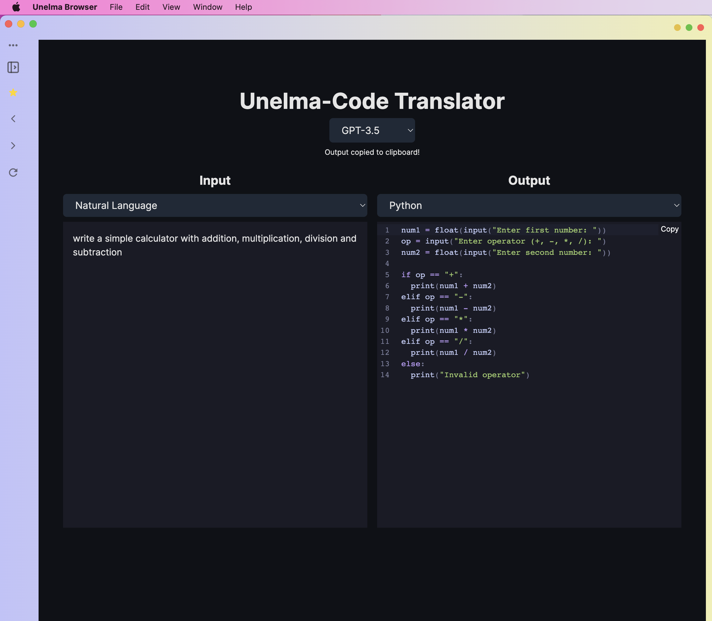

# Unelma-Code Translator

Use Unelma-Code Translator to translate code from one language to another.



## Running Locally

**1. Clone Repo**

```bash
git clone https://github.com/unelmacoin/unelma-code-translate
```

**2. Install Dependencies**

```bash
npm i
```

**3. Run App**

```bash
npm run dev
```

# Contribution

If you want to contribute, feel free to open pull request and push changes. All changes is going through review process.

# Contact

Please send private message if you would need help or want to ask for feature requests

<br>Website: https://u16p.com
<br>Facebook: https://www.facebook.com/unelmaplatforms
<br>Twitter: https://twitter.com/unelmaplatforms